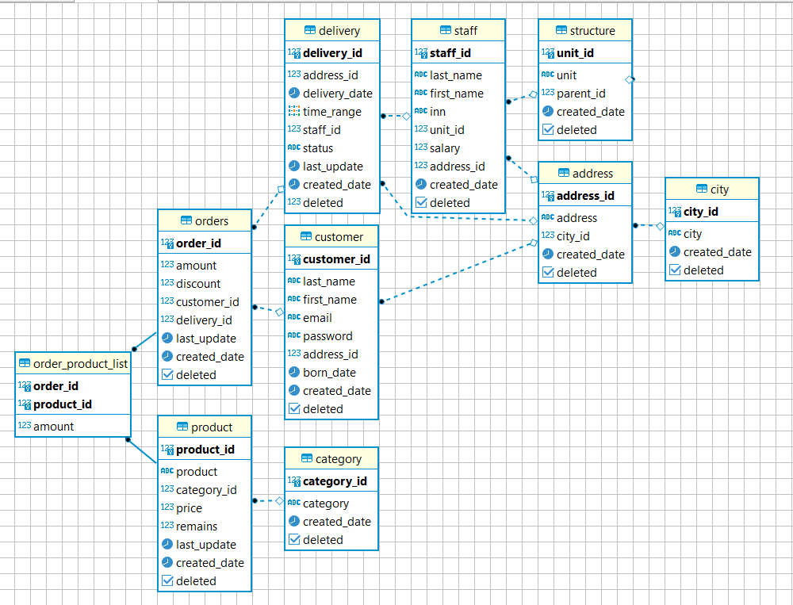

# Netology SQLFREE-1 Homework


**Подключится к облачной базе данных**
Параметр | Значение 
:-------- | :-------
Host: | 84.201.152.11
Port: | 19001
DB: | postgres
User: | netology
Pass: | ******


<details>
  <summary>Схема базы данных</summary>

  
</details>

## Написать запросы, по следующим задачам:
*1. Какое количество заказов было совершено* - (9465) 
```sql
SELECT count(order_id) FROM orders; 
```
*2. Какое количество товаров находится в категории “Игрушки”* - (1)
```sql
SELECT count(p.product)
FROM product p 
JOIN category c 
ON p.category_id = c.category_id
WHERE category = 'Игрушки';
```

*3. В какой категории находится больше всего товаров* -  (Музыка - 64)
```sql
SELECT count(p.product) AS amount, c.category
FROM product p 
JOIN category c 
ON p.category_id = c.category_id
GROUP BY c.category
ORDER BY amount DESC;
```
*4. Сколько “Черепах” купила Williams Linda?* - (3)
```sql
SELECT CONCAT (last_name, ' ', first_name) AS customer_name, opl.amount, p.product
FROM customer c 
JOIN orders o 
ON c.customer_id = o.customer_id 
JOIN order_product_list opl 
ON o.order_id = opl.order_id 
JOIN product p 
ON opl.product_id = p.product_id 
WHERE last_name = 'Williams' AND first_name = 'Linda' AND p.product = 'Черепаха';
```

*5. С кем живет Williams Linda?* - (Mitchell Janet)
```sql
SELECT CONCAT (s.last_name, ' ', s.first_name) AS s_name, address  
FROM customer c
JOIN address a
ON c.address_id = a.address_id 
JOIN staff s 
ON a.address_id = s.address_id 
WHERE c.last_name = 'Williams' AND c.first_name = 'Linda'
ORDER BY s_name DESC;
```
*По результату запросов необходимо пройти тест и проверить себя.*